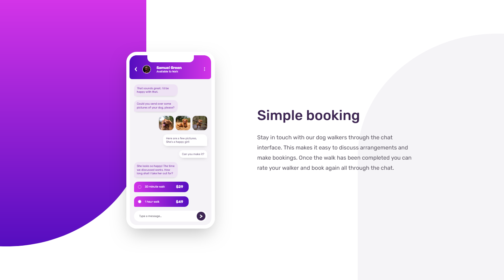

# Frontend Mentor - Chat app CSS illustration solution

This is a solution to the [Chat app CSS illustration challenge on Frontend Mentor](https://www.frontendmentor.io/challenges/chat-app-css-illustration-O5auMkFqY). Frontend Mentor challenges help you improve your coding skills by building realistic projects. 

## Table of contents

- [Overview](#overview)
  - [The challenge](#the-challenge)
  - [Screenshot](#screenshot)
  - [Links](#links)
- [My process](#my-process)
  - [Built with](#built-with)
  - [What I learned](#what-i-learned)
- [Author](#author)

## Overview

### The challenge

Users should be able to:

- View the optimal layout for the component depending on their device's screen size
- **Bonus**: See the chat interface animate on the initial load

### Screenshot

### Links

- Solution URL: [Add solution URL here](https://github.com/Absynthee/chat-app-css-illustration-master)
- Live Site URL: [Add live site URL here](https://absynthee.github.io/chat-app-css-illustration-master/)

## My process

### Built with

- Semantic HTML5 markup
- CSS custom properties
- Flexbox
- CSS Nesting
- Lottie

### What I learned

This was a great challenge with lots of little css tricks. It was fun trying to build the phone screen as I've never had to do that before. The hardest part was getting it all to be responsive so it scales up and down at the same rate.

I used `clamp()` for the first time and it's a good way of controlling the min and max restrictions of an element.

I changed some of the colours slightly to make sure they meet the WCAG contrast requirements.

I was able to complete the bonus challenge of having the screen load progressively upon opening the window, as well as adding a couple of little easter eggs and a nice floating animation on the phone container.

## Author

- Website - [Austin Spillman](https://www.austinspillman.com)
- Frontend Mentor - [@Absynthee](https://www.frontendmentor.io/profile/Absynthee)
